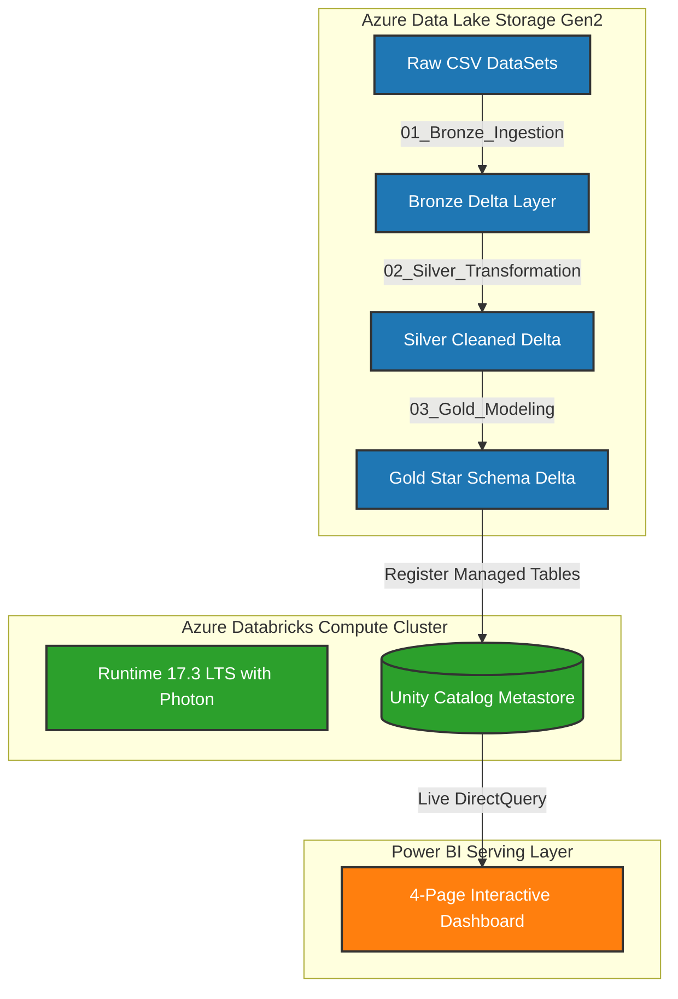

# Food Delivery Analytics: End-to-End Data Engineering & BI on Azure Databricks

This repository contains the finalized code, datasets, and visualizations for my capstone project: **Food Delivery Analytics Platform**. 

The project implements a production-grade, end-to-end data engineering pipeline using the **Medallion Architecture (Bronze → Silver → Gold)** on **Microsoft Azure** and **Azure Databricks**, culminating in a conformed **Star Schema** data model consumed live in **Power BI** via **DirectQuery**.

---

## 1. Project System Topology & Architecture



### Infrastructure Configuration Details:
*   **Cloud Platform**: Microsoft Azure
*   **Primary Storage**: Azure Data Lake Storage Gen2 (ADLS Gen2) account `fooddeliveryadls`, container `sat-activity`.
*   **Compute Cluster**: Azure Databricks Single Node cluster running **Databricks Runtime 17.3 LTS (with Photon Acceleration)**.
    *   *Note on Region Selection*: Due to default vCPU core subscription limits (regional VM core quotas) in the West India region on free trial tiers, the Databricks workspace was successfully deployed in the **East US** region (`food-delivery-dbw-east`) to ensure compute availability.
*   **Data Governance**: **Unity Catalog** metastore (`food_delivery_dbw_east`) target schema `default`.

---

## 2. Medallion Data Pipeline Walkthrough

The data pipeline runs sequentially across three Python notebooks, located in the `Databricks Notebooks/` folder:

### Step 1: Bronze Ingestion Layer (`01_Bronze_Ingestion.py`)
*   **Purpose**: Performs a faithful, 1:1 ingestion of raw CSV datasets into immutable Delta Lake format.
*   **Process Flow**:
    1.  Configures parameter widgets for ADLS Gen2 connection credentials.
    2.  Removes existing Bronze directories to ensure safe, idempotent reruns.
    3.  Runs an ingestion loop over the 4 raw sources (`orders.csv`, `orders_cdc.csv`, `users_scd.csv`, `restaurants_scd.csv`).
    4.  Enriches each record with metadata audit columns: `_ingestion_timestamp` (current time) and `_source_file_name` (origin path).
    5.  Implements **per-source isolation** inside a try-except loop so that a failure in one CSV file does not block other datasets from ingesting.
    6.  Validates output paths using `dbutils.fs.ls()`.

### Step 2: Silver Transformation Layer (`02_Silver_Transformation.py`)
*   **Purpose**: Cleanses, standardizes, and conforms Bronze records while merging incremental order changes.
*   **Process Flow**:
    1.  **Data Standardization**: Defines a reusable `clean_dataframe()` function that trims whitespace and applies `initcap()` to all string columns.
    2.  **Change Data Capture (CDC) Merge**: 
        *   Deduplicates incremental updates from `orders_cdc` using a `ROW_NUMBER()` window partition by `order_id` ordered by `updated_at DESC`.
        *   Checks for the existence of the base Silver table. If it's a first-run, it initializes it.
        *   Applies a `DeltaTable.merge()` (upsert logic) to update status changes (e.g. `Ordered` → `Preparing` → `Delivered`) and inserts new orders.
        *   Applies default values (`"Ordered"` status and base timestamps) for missing transactional details.
    3.  **Dimension Processing**: Processes users and restaurants dimensions with SCD (Slowly Changing Dimension) Type 2 tracking, including the `_processed_at` audit timestamp.

### Step 3: Gold Modeling Layer (`03_Gold_Modeling.py`)
*   **Purpose**: Models conformed datasets into a reporting Star Schema, pre-computes analytical KPIs, and optimizes query layouts.
*   **Process Flow**:
    1.  **Dimension Tables**: Selects active reporting records (`is_current = true`) to form `gold_dim_users` and `gold_dim_restaurants`.
    2.  **Fact Table**: Joins Silver orders with conformed dimensions to construct the denormalized `gold_fact_orders` table (containing `city`, `restaurant_name`, `cuisine`, and `rating`).
    3.  **Z-Order Optimization**: Executes Delta optimization on `gold_fact_orders` using `ZORDER BY (order_timestamp)` to accelerate time-series lookups.
    4.  **Pre-computed KPI Aggregates**: Aggregates business metrics in Spark memory to write three analytical data marts:
        *   `gold_kpi_revenue_by_city` (total revenue and orders count per city).
        *   `gold_kpi_restaurant_performance` (sales, average rating, and order volume per partner).
        *   `gold_kpi_daily_trends` (time series of daily operations).

---

## 3. Data Governance Architecture: Why We Avoided Hive Metastore

The project specifications document originally suggested registering serving tables in the legacy metastore (`hive_metastore`). However, during implementation, we chose **not** to use `hive_metastore` for the following critical reasons:

### The Problem with Hive Metastore:
1.  **Security Restrictions (`UC_HIVE_METASTORE_DISABLED_EXCEPTION`)**: Premium Databricks clusters running under standard Shared or Single User access modes restrict access to the legacy Hive Metastore by default to enforce modern Unity Catalog data governance.
2.  **Path Credential Errors (`NO_PARENT_EXTERNAL_LOCATION_FOR_PATH`)**: Databricks prevents the registration of external tables using raw cloud paths (`abfss://...`) unless an Access Connector and Storage Credential are pre-configured in Unity Catalog. 

### The Solution: Migration to Unity Catalog Managed Tables
To bypass these security limits while aligning the project with modern cloud architecture, we migrated to **Unity Catalog Managed Tables**:
*   We switched the session context using:
    ```sql
    USE CATALOG food_delivery_dbw_east;
    ```
*   We registered all 6 Gold tables as **Managed Delta Tables** directly inside the catalog:
    ```python
    df.write.format("delta").mode("overwrite").saveAsTable("default.gold_fact_orders")
    ```
*   This allowed Databricks to manage the underlying storage location automatically within the catalog's metadata boundary, bypassing path credential checks while providing premium metadata tracking.

---

## 4. Interactive Power BI Dashboard Design

The Power BI dashboard connects directly to the Databricks cluster via **DirectQuery** and is structured into **4 distinct reporting pages**:

### Page 1: Executive Summary
*   *Purpose*: High-level financial and regional performance monitoring.
*   *Key Visuals*:
    *   **Geographic Sales Map**: Map visual mapping bubble sizes to total revenues across Delhi, Mumbai, Jaipur, and Bangalore.
    *   **City Comparison Chart**: Clustered horizontal bar chart comparing total sales across cities.
    *   **Total Revenue KPI**: Prominent KPI card displaying the total corporate sales metric (`9M`).
*   *Source Table*: `gold_kpi_revenue_by_city`

### Page 2: Restaurant Leaderboard
*   *Purpose*: Sales rankings and partner rating index.
*   *Key Visuals*:
    *   **Leaderboard Table**: Ranked grid displaying restaurant names, cuisines, order volume, revenue, and average ratings.
    *   **Cuisine Breakdown**: Pie chart illustrating the sales percentage split across different cuisines (Italian, Indian, Fast Food, Chinese).
*   *Source Table*: `gold_kpi_restaurant_performance`

### Page 3: Daily Operations
*   *Purpose*: Time-series operational load monitoring.
*   *Key Visuals*:
    *   **Daily Revenue Timeline**: Line chart plotting daily revenue trends.
    *   **Daily Order Volume**: Clustered column chart plotting daily order requests.
*   *Source Table*: `gold_kpi_daily_trends` (since the raw source data has orders on April 17, 2026, it shows a single-day peak).

### Page 4: Order Drillthrough
*   *Purpose*: Customer support ticket search and raw transaction lookup.
*   *Key Visuals*:
    *   **Transaction Table**: Granular list displaying raw order details.
    *   **Checkbox Slicers**: Dropdown filters allowing real-time filtering of transactions by City, Order Status, and Restaurant name.
*   *Source Table*: `gold_fact_orders`

---

## 5. Technical Competencies Demonstrated
*   **Medallion Storage Layering**: Progressive data quality refining using Bronze, Silver, and Gold delta stages.
*   **Incremental CDC Processing**: Merging updates in Spark using Delta Lake `MERGE INTO` API.
*   **Governance & Security**: Transitioning legacy workflows to Unity Catalog managed schemas.
*   **Query Performance Tuning**: Accelerating time-series queries via Z-Ordering layout optimization.
*   **DirectQuery BI Integration**: Live, zero-latency dashboard slicing in Power BI using Databricks JDBC connectors.
