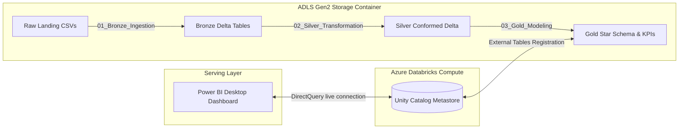

# Food Delivery Analytics: End-to-End Data Engineering & BI on Azure Databricks

This repository contains my capstone project for implementing a production-grade, end-to-end data engineering pipeline and interactive business intelligence dashboard. 

The project is built on **Microsoft Azure** using **Azure Databricks (LTS 17.3, Photon Engine)** and **Azure Data Lake Storage Gen2 (ADLS)**. It implements a three-tier **Medallion Architecture (Bronze → Silver → Gold)** using **Delta Lake**, leading to a clean, conformed **Star Schema** data model consumed in **Power BI** via **DirectQuery**.

---

## 1. Project Architecture Flow



### Ingestion & Transformation Details:
*   **Bronze Layer**: 1:1 raw CSV ingestion into Delta format with structural headers and lineage metadata tracking columns (`_ingestion_timestamp`, `_source_file_name`).
*   **Silver Layer**:
    *   **Data Cleansing**: Custom PySpark transformations applying string trimming and initial capitalization (`initcap`) to enforce data consistency.
    *   **CDC (Change Data Capture) Merge**: Window-based deduplication using `ROW_NUMBER()` partitioned by `order_id` ordered by `updated_at DESC` to extract the latest state of each order. Transactional changes are merged incrementally into the base orders table using `DeltaTable.merge()`.
    *   **Dimension Processing**: Dimension datasets are processed with SCD (Slowly Changing Dimension) Type 2 tracking, including audit timestamps.
*   **Gold Layer**:
    *   **Star Schema Model**: Dim-Fact modeling joining Silver orders with conformed dimensions to build `gold_dim_users`, `gold_dim_restaurants`, and the denormalized `gold_fact_orders` table.
    *   **Z-Order Optimization**: Fact table data is layout-optimized using Z-Ordering on `order_timestamp` to accelerate time-series analytical queries.
    *   **Pre-computed KPIs**: Pre-aggregates daily operations, restaurant rankings, and city-level revenues to reduce run-time computation overhead.
*   **Data Governance**: All Gold tables are registered inside the workspace's Unity Catalog (`food_delivery_dbw_east.default`) for centralized access control and metadata discovery.

---

## 2. Repository Folder Structure

The project assets are organized as follows:

```text
Food-Delivery-Analytics/
│
├── Databricks Notebooks/                 # Production-ready Databricks python scripts
│   ├── screenshots/                      # Pipeline run execution screenshots
│   ├── 01_Bronze_Ingestion.py            # Ingestion loop & ADLS configuration
│   ├── 02_Silver_Transformation.py       # Data cleaning, SCD Type 2 & CDC merge
│   └── 03_Gold_Modeling.py               # Star Schema modeling, KPIs & Z-Ordering
│
├── Azure/                                # Cloud resource structure evidence
│   └── screenshots/                      # Resource Group & ADLS Gen2 container screenshots
│
├── Power BI/                             # Business Intelligence reporting assets
│   ├── README.md                         # Dashboard details and layout overview
│   └── Food_Delivery_Analytics_Dashboard.pbix  # The Power BI report file
│
├── DataSets/                             # Source transactional datasets
│   ├── orders.csv                        # Base orders data
│   ├── orders_cdc.csv                    # Incremental CDC order updates
│   ├── users_scd.csv                     # Users master data with SCD markers
│   └── restaurants_scd.csv               # Restaurants master data with SCD markers
│
└── README.md                             # This documentation file
```

---

## 3. Recommended Power BI Dashboard Layout

The Power BI workbook connects directly to the Databricks cluster via **DirectQuery** and is structured into **4 distinct reporting pages** to address different stakeholder requirements:

### Page 1: Executive Summary
*   **Primary Source**: `gold_kpi_revenue_by_city`
*   **Visuals**:
    *   *Geographic Sales Map*: Displays city-level revenue distribution using bubble sizes mapped over India (Mumbai, Jaipur, Bangalore, Delhi).
    *   *City Comparison Chart*: A clustered horizontal bar chart comparing revenues across regions.
    *   *Overall Sales Card*: A prominent KPI card displaying the total global revenue metric (`9M`).

### Page 2: Restaurant Leaderboard
*   **Primary Source**: `gold_kpi_restaurant_performance`
*   **Visuals**:
    *   *Performance Grid*: A ranked table displaying `restaurant_name`, `cuisine`, `order_count`, `revenue`, and `avg_rating`.
    *   *Cuisine Distribution*: A pie chart illustrating the revenue split percentage across different food categories.

### Page 3: Daily Operations
*   **Primary Source**: `gold_kpi_daily_trends`
*   **Visuals**:
    *   *Revenue Timeline*: A line chart plotting daily revenue fluctuations over time.
    *   *Order Volume*: A clustered column chart tracking the daily count of order requests.

### Page 4: Order Drillthrough
*   **Primary Source**: `gold_fact_orders`
*   **Visuals**:
    *   *Transaction Browser*: A comprehensive table displaying raw order metadata (`order_id`, `order_timestamp`, `city`, `restaurant_name`, `cuisine`, `status`, `total_amount`).
    *   *Granular Filters*: Slicers allowing dynamic filtering of transaction details by City, Order Status, and Restaurant name.

---

## 4. Pipeline Execution & Deployment Instructions

### Prerequisites:
1.  An Azure Subscription with an ADLS Gen2 Storage Account.
2.  An Azure Databricks Premium Workspace with a running Single Node cluster (Runtime 17.3 LTS).

### Step 1: Upload Source Datasets
*   Upload the four CSV files from the `DataSets/` folder of this repository into your ADLS Gen2 container (e.g. `sat-activity/raw/`).

### Step 2: Import & Configure Databricks Notebooks
*   Import the files from `Databricks Notebooks/` into your workspace.
*   Attach them to your running cluster.
*   Fill in the widgets at the top of each notebook with your Azure storage credentials:
    *   `storage_account_name`: Your storage account name.
    *   `container_name`: Your storage container name.
    *   `storage_account_key`: Your ADLS access key.

### Step 3: Run the Pipeline
*   Execute the notebooks in sequence:
    1.  `01_Bronze_Ingestion`
    2.  `02_Silver_Transformation`
    3.  `03_Gold_Modeling`

### Step 4: Load & Configure Power BI
*   Open the `Food_Delivery_Analytics_Dashboard.pbix` in Power BI Desktop.
*   Edit the data source parameters to point to your Databricks cluster using your cluster's **Server Hostname**, **HTTP Path**, and **Personal Access Token (PAT)**.
*   Refresh data connection to update visual charts live.

---

## 5. Technical Competencies Demonstrated
*   **Cloud Architecture**: Azure cloud resource provisioning, ADLS Gen2 blob integration, and ABFSS protocol configuration.
*   **Distributed Computing**: PySpark DataFrame API development, advanced Spark SQL joins, and window analytical partition functions.
*   **Delta Lake & ACID**: CDC merges utilizing match/no-match conditions, schema evolution control (`mergeSchema=true`), and storage optimizations (Z-Order index optimization).
*   **Enterprise Data Modeling**: Design of dimension and fact tables, Slowly Changing Dimensions (SCD Type 2), and pre-aggregated data marts.
*   **Business Intelligence**: Live DirectQuery connections, data modeling design, and multi-page dashboard orchestration.

<!-- Project submission finalized. -->
