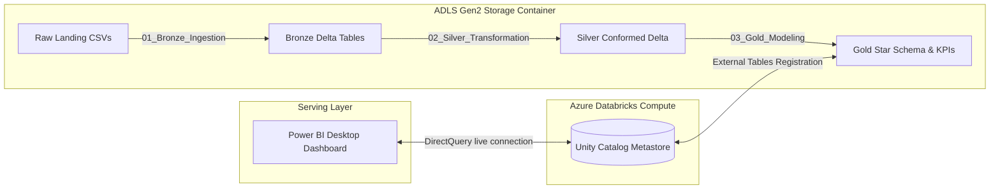

# Food Delivery Analytics: End-to-End Data Engineering & BI on Azure Databricks

This repository contains my capstone project for implementing a production-grade, end-to-end data engineering pipeline and interactive business intelligence dashboard. 

The project is built on **Microsoft Azure** using **Azure Databricks (LTS 17.3, Photon Engine)** and **Azure Data Lake Storage Gen2 (ADLS)**. It implements a three-tier **Medallion Architecture (Bronze → Silver → Gold)** using **Delta Lake**, leading to a clean, conformed **Star Schema** data model consumed in **Power BI** via **DirectQuery**.

---

## 1. Project Architecture Flow

