# Week 4: Azure Cloud Fundamentals and Data Pipeline Implementation using Azure Data Factory (ADF)

## 📌 Project Overview
The goal of Week 4 was to understand and implement automated data movement in the cloud using Azure services. Unlike Weeks 1–3, which focused on localized analysis with Python and SQL, Week 4 shifted focus toward cloud architecture and building an end-to-end automated data pipeline.

An automated data pipeline collects, validates, moves, and transforms data between services without manual intervention. This project implements a classic e-commerce data pipeline flow where transaction details are uploaded, validated, and processed safely.

---

## 🏗️ Architecture of the Pipeline
The data flow of the pipeline is structured as follows:

```text
Sample - Superstore.csv
         │
         ▼
 Azure Blob Storage (Source)
         │
         ▼
 Azure Data Factory (ADF)
         │
 ┌───────┴──────────────┐
 │                      │
 ▼                      ▼
Get Metadata        Copy Data
 │                      │
 └───────┬──────────────┘
         │
         ▼
output-superstore.csv (Destination)
```

---

## 📂 Repository Directory Structure
This week's task is organized into the following directories:
* [Task_1_Resource_Group](./Task_1_Resource_Group/) - Setup of the logical project container.
* [Task_2_Storage_Setup](./Task_2_Storage_Setup/) - Configuration of the Cloud Storage Account and Blob Container.
* [Task_3_ADF_Basics](./Task_3_ADF_Basics/) - Creation of Azure Data Factory, Linked Services, and Datasets.
* [Task_4_Pipeline_Development](./Task_4_Pipeline_Development/) - Development of the Copy and Metadata pipeline.
* [Task_5_Pipeline_Execution](./Task_5_Pipeline_Execution/) - Debugging, execution, and verification.
* [Task_6_IAM_Roles](./Task_6_IAM_Roles/) - Implementing Azure RBAC (Identity & Access Management).
* [Mini_Project](./Mini_Project/) - Consolidating all tasks into an end-to-end executing pipeline.

---

## 🛠️ Step-by-Step Implementation Details

### Step 1: Resource Group Setup
A **Resource Group** acts as a logical container that groups all the related Azure resources for this project under a single lifecycle.
* **Resource Group Name:** `rg-de-internship`
* **Region:** East US (or preferred region)

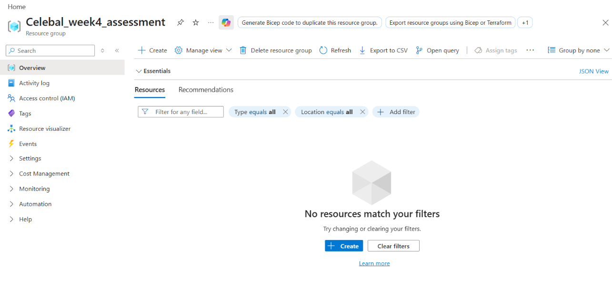

---

### Step 2: Storage Account & Blob Container Setup
Azure Storage Account is Microsoft's cloud storage solution. Within the storage account, a Blob (Binary Large Object) Container was created to store files.
* **Storage Account Name:** `stdeinternship`
* **Container Name:** `superstore-data`
* **Uploaded File:** `Sample - Superstore.csv` (Source file for the pipeline)

| Storage Account | Blob Container with CSV File |
| :---: | :---: |
| 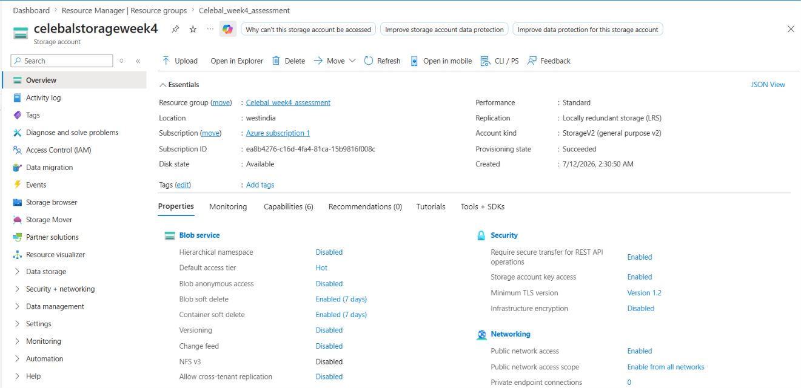 |  |

---

### Step 3: Azure Data Factory & Connection Setup
Azure Data Factory (ADF) is a cloud-based data integration service used to orchestrate data movement and transformation.
1. **ADF Instance:** Created to manage the workflow.
2. **Linked Service:** Acts as the connection string containing authentication credentials (Account Key) to access the Storage Account.
3. **Datasets:** Pointers to the exact files within the storage account.
   - **Source Dataset:** Points to `Sample - Superstore.csv`.
   - **Destination Dataset:** Points to the target file `output-superstore.csv`.

#### ADF Overview
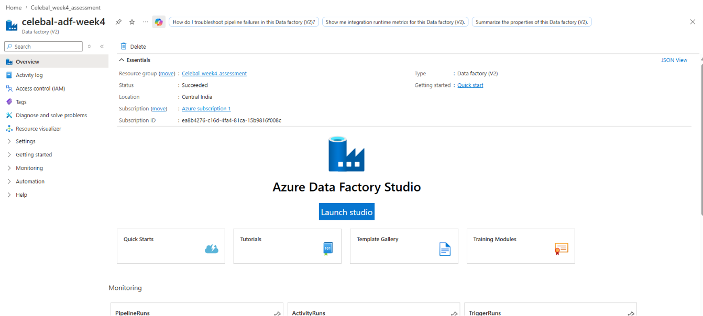

#### Linked Service & Datasets Configuration
* **Linked Service Configuration:**
  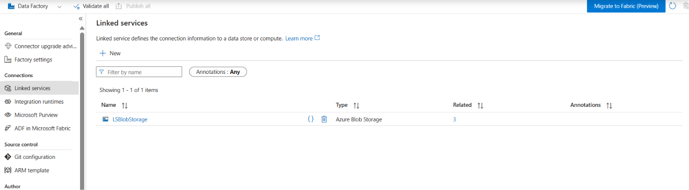
* **Source & Destination Datasets:**
  | Source Dataset | Destination Dataset | Get Metadata Dataset |
  | :---: | :---: | :---: |
  | 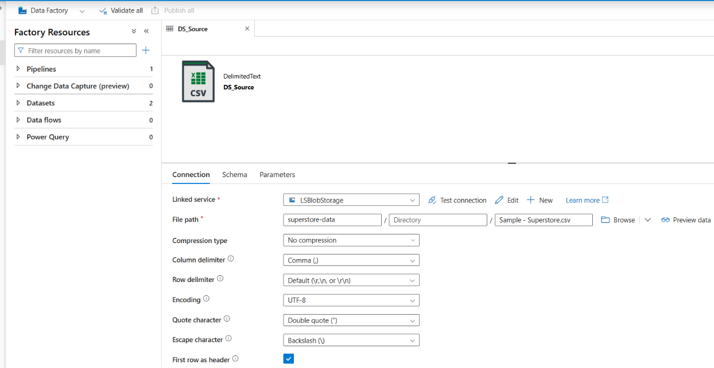 | 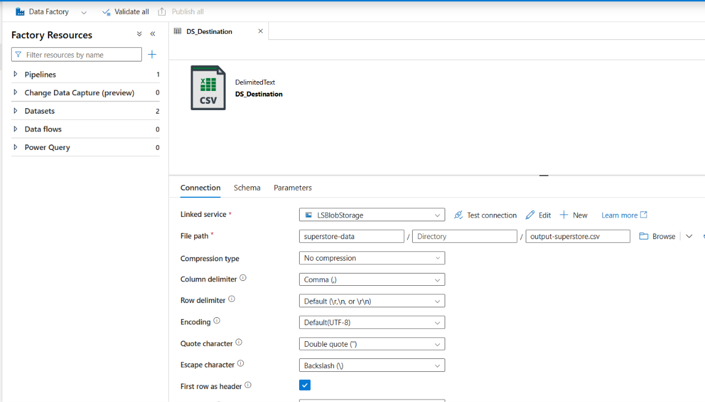 | 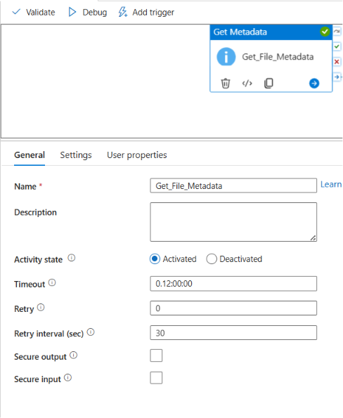 |

---

### Step 4: Pipeline Development
The pipeline is the central workflow of Azure Data Factory. It contains a sequence of activities:
1. **Get Metadata Activity:** Validates the input file before copying (checks if the file exists, size, type, etc.).
2. **Copy Data Activity:** Safely copies data from the source dataset to the destination dataset.
3. **Fault Tolerance Configuration:** During initial execution, parsing issues may occur. Fault Tolerance was configured to skip incompatible/malformed rows and continue copying valid data without failing the whole pipeline run.

| Pipeline Design Overview | Column Mappings |
| :---: | :---: |
| 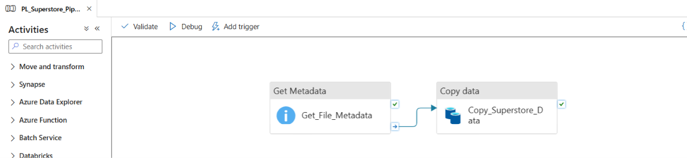 | 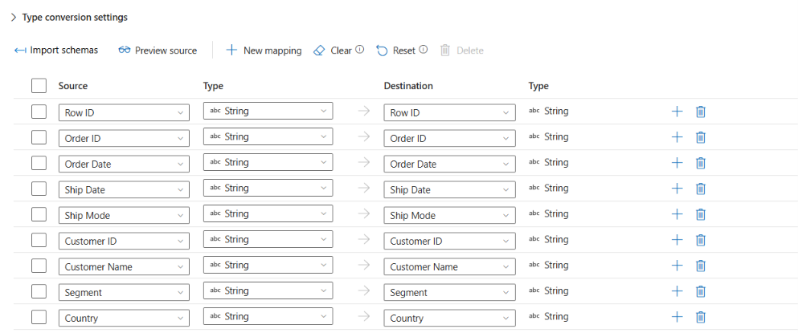 |

| Source Settings | Sink Settings |
| :---: | :---: |
| 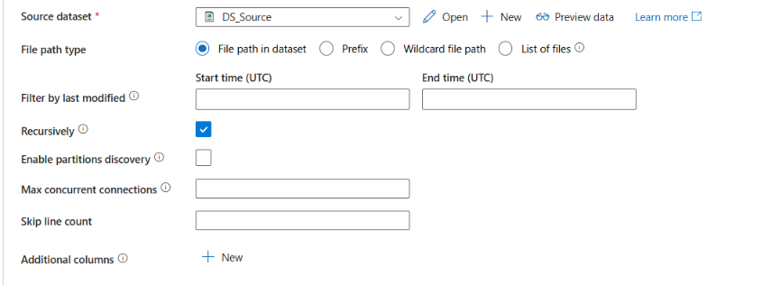 | 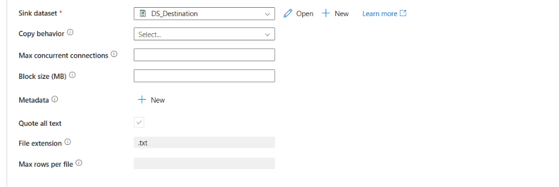 |

---

### Step 5: Pipeline Execution & Monitoring
The pipeline was executed using the **Debug** option in ADF and completed successfully.
* **Status:** `Succeeded`
* **Log Check:** Verified that all activities ran in sequence (`Get Metadata` -> `Copy Data`).

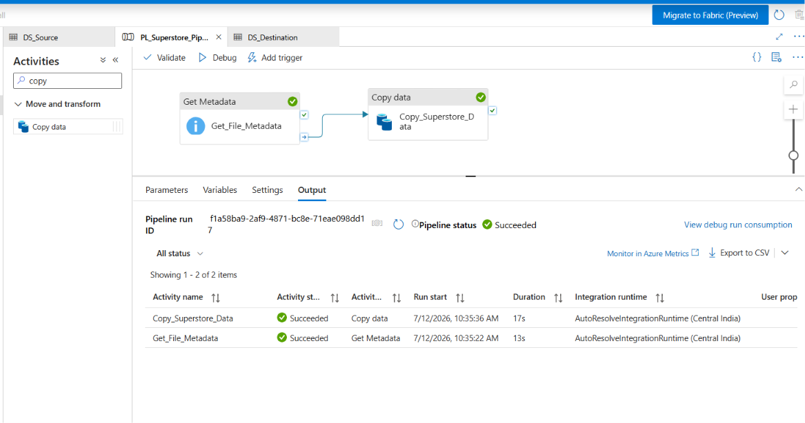

---

### Step 6: Identity & Access Management (IAM) Roles
Instead of using static Storage Account Keys (which is less secure for production), we implemented Azure role-based access control (RBAC):
* Assigned **Storage Blob Data Reader** and **Storage Blob Data Contributor** permissions directly to the **Azure Data Factory Managed Identity**.
* This ensures that ADF has secure, keyless access to the storage account.

#### Assigned Roles Overview
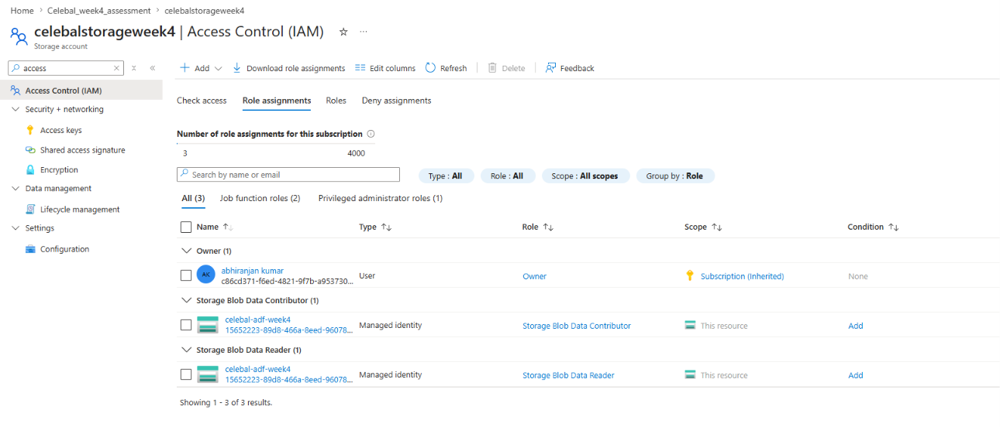

#### Specific Roles: Reader & Contributor
| Storage Blob Data Reader | Storage Blob Data Contributor |
| :---: | :---: |
| 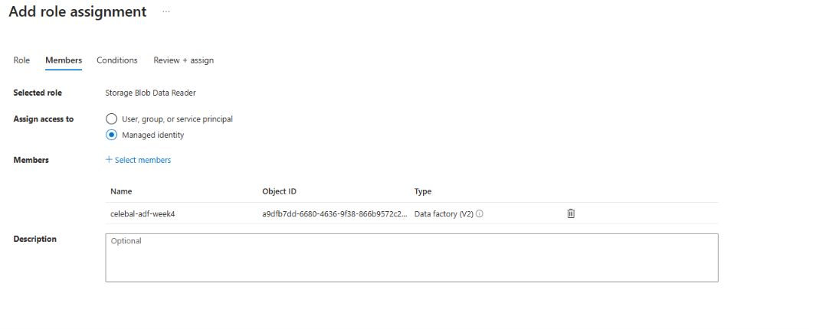 | 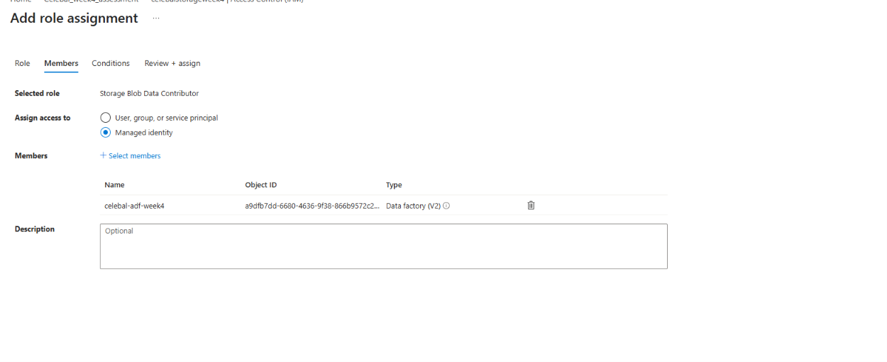 |

---

## 🏆 Mini-Project: End-to-End Pipeline Execution
The Mini-Project ties all the steps together into a fully validated production pipeline.

1. **Source Setup:** Input CSV in blob container.
2. **Execution:** Pipeline reads metadata, checks validation rules, and copies data using Fault Tolerance.
3. **Destination:** Generates `output-superstore.csv` in the destination folder.

#### Pipeline Run
* **Get Metadata Activity execution details:**
  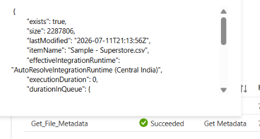
* **Pipeline Run Successful:**
  

#### Storage Verification
* **Source CSV in Storage:**
  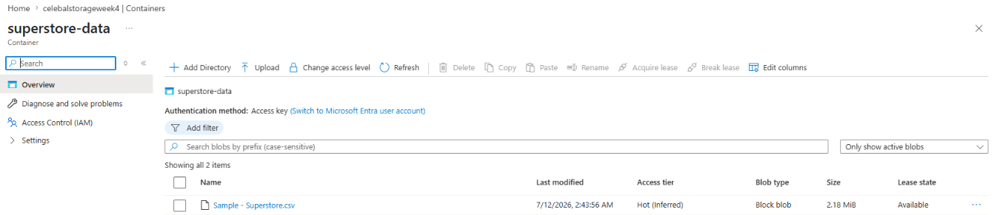
* **Created Destination CSV output:**
  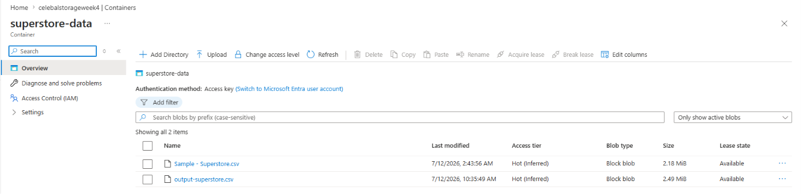

---

## 🔑 Key Interview Insights & Highlights
* **Linked Service vs. Dataset:** A Linked Service defines the connection to the data source (e.g., host name, credentials), while a Dataset refers to the structure of the data (e.g., table name, file path, CSV configuration) pointing to that source.
* **Account Key vs. RBAC (IAM):** Authenticating with an Account Key gives full administrative access (less secure). Using RBAC with Managed Identities assigns fine-grained, secure, keyless access permissions to the ADF service.
* **Fault Tolerance:** If some rows contain malformed values (e.g., incorrect column counts or datatypes), ADF can be configured to skip them or log them to an error file rather than failing the entire ETL pipeline.
